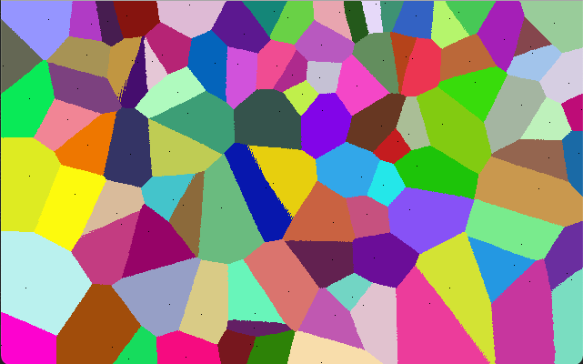

# python-map-generator
An attempt at a program generating maps for TTRPG games
Using [Pygame](https://www.pygame.org) library

At the moment, it is generating a [voronoi diagram](https://en.wikipedia.org/wiki/Voronoi_diagram) of 100 sites
(without any optimization)
## Screenshots
