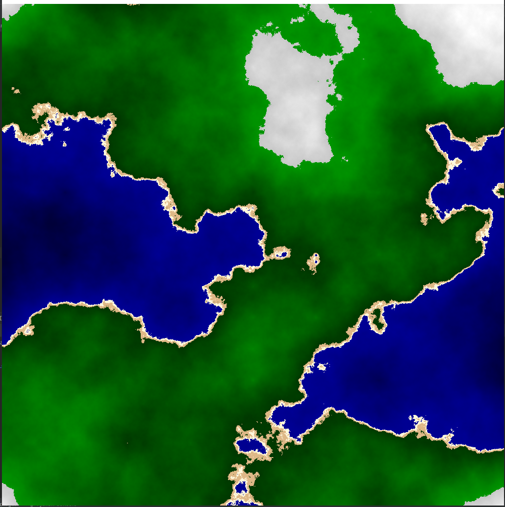

# python-map-generator
An attempt at a program generating maps for TTRPG games
Using [Pygame](https://www.pygame.org) library

At first, it was generating a [voronoi diagram](https://en.wikipedia.org/wiki/Voronoi_diagram) of 100 sites
(without any optimization)

Now it's generating a 1024 * 1024 heightmapp using the [Diamond Square algorithm](https://en.wikipedia.org/wiki/Diamond-square_algorithm),
that is arbitrarily colored. It looks more like a map I would like to see in a game now. 

Next step would be to combine voronoi with diamond square, if that's possible

## Screenshots

